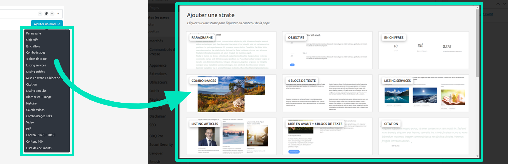

# ACF Beautiful Flexible

Transform ACF's flexible layouts list into a beautiful popup.

To use ACF Beautiful Flexible, simply activate the plugin to improve the ACF flexible UI. By default, it uses random images, but the idea is to customize them by adding your own.

## Image convention

* The size of the image should be 366x150 or bigger, into 732x300.
* They should be named based on the flexible key (`push_2_light`) with no underscores but dashes (`push-2-light.[extension]`).
* The following extensions will be resolved in that order: `.jpg`, `.jpeg`, `.png` and `.gif`.

## Where images should be situated

They should more likely be situated into your theme `wp-content\themes\my-theme\assets\acf-beautiful-flexible\`. But if you have a child-theme and added images into it, these will overwrite those from parent-theme.
The following directories will be solved according to order: plugin's folder, child theme's folder, theme's folder.

Also note that you can filter this path to gather all your images into a same folder:

`add_filter( 'acf_beautiful_flexible.images_path', $path );`

Finally, you could filter all images like this:

`add_filter( 'acf_beautiful_flexible.images', $images );`

# Requirements

- [ACF Pro](https://www.advancedcustomfields.com/) plugin 5.6+
- WordPress 4.7+ because of [get_theme_file_uri()](https://developer.wordpress.org/reference/functions/get_theme_file_uri)

# Installation

## WordPress

- Download and install using the built-in WordPress plugin installer.
- Site activate in the "Plugins" area of the admin.
- Then [add](#how-) your awesome layouts images.

## [Composer](http://composer.rarst.net/) with [WordPress Packagist](https://wpackagist.org/search?q=acf-beautiful-flexible)

- Alternatively add the [source](https://wpackagist.org).
- Include `"wpackagist-plugin/acf-beautiful-flexible":"dev-trunk"` in your composer file for last commits.
- Then [add](#how-) your awesome layouts images.

# Contributing

Please refer to the [contributing guidelines](.github/CONTRIBUTING.md) to increase the chance of your pull request being merged and/or receiving the best support for your issue.

If you identify any errors or have an idea for improving the plugin, feel free to open an [issue](../../issues/new) or [create a pull request](../../compare). Please provide as much info as needed in order to help me resolve/approve your request.

# Credits

I, [Maxime Culea](https://profiles.wordpress.org/MaximeCulea), have created this plugin which I only maintain. I do not guarantee some free support. Also, thank others listed in the [credits](CREDITS.md).

Finally, if you really like what I do or want to thank me for my work, feel free [to donate](https://www.paypal.com/paypalme/maximeculea), even 1€ is a great gift for buying some coffee :)
